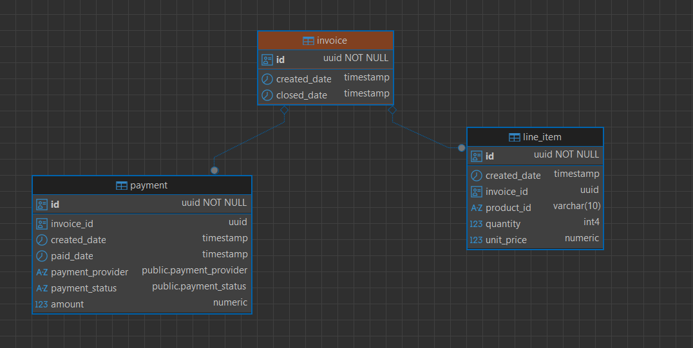

# Application overview and scope covered

## Application scope
- This application is a simple invoice management system.
- Allows creating a list, get an invoice by id and update line items of a given invoice.
- Allows creating a payment for an invoice.
  - mocking a payment service provider
    - PAYPAL: Is hardcode with SUCCESS
    - STRIPE: Is hardcoded with FAILURE
- Given time constraints,
  - Not included authentication or authorization mechanisms, though it would be nice to have :D.
  - Not included a re checking mechanism for payment status PENDING or INITIATED.
  - Not included an endpoint to get the payment info.

## Database model 

**Notes:** 
    1. The database is created using Flyway with postgres.
    2. If you keep the default username and password and use the docker compose to startup, username: postgres, password: invoice_password

## Available endpoints
- GET /api/v1/invoice
- GET /api/v1/invoice/{id}
- POST /api/v1/invoice
- PATCH /api/v1/invoice/{id}/line-items
  -  Decided to go with a full replacement of the line items instead of a single update or push of line items.
    Given there are few products in the db, replacing the whole list is not a big deal and replacing the whole list is a bit easier to implement. For larger lists of possible products, it would be better a single put of an element.
- POST /api/v1/invoice/{id}/payment
  - Each payment request is treated as a new payment
  - The db ensures uniqueness of payment
  - If there is an active payment for the invoice, (payment status is PAID, PENDING or INITIATED), a new payment request will fail.
  - If the payment is FAILED, `a new payment can be send.`
    - The payment response status is mocked to either SUCCESS or FAILURE

# Running the application

To run the application, follow these steps
1. Navigate to the root directory of the project
2. Verify that you have docker installed and is running
3. Run the following command: ./run-me.sh in a terminal that supports bash scripts
4. Wait for the application to start and open http://localhost:8080/swagger-ui/index.html#/
5. Enjoy
**Note:**
If you want to run the application without docker,
**This is the easiest way to run the application
It will run a build of the project, create a docker image and run it in a docker compose
the docker compose will also create a database container**

# Smoke tests

To run the smoke tests, follow these steps
1. Navigate to the root directory of the project
2. Run the following command: ./run-me.sh in a terminal that supports bash scripts
3. In the root directory of the project, run **./gradlew clean smokeTests**
This will run a set of basic smoke tests to ensure the application is working as expected